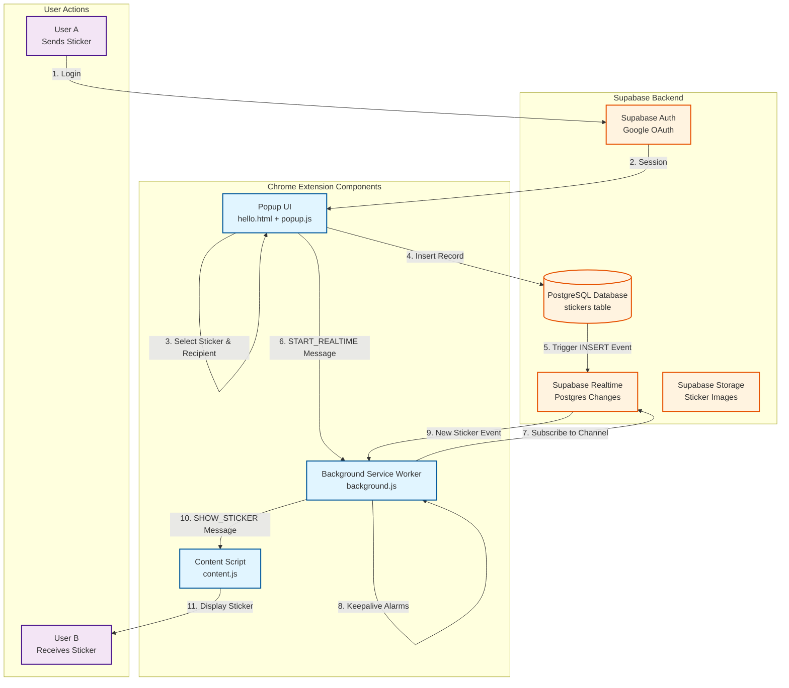
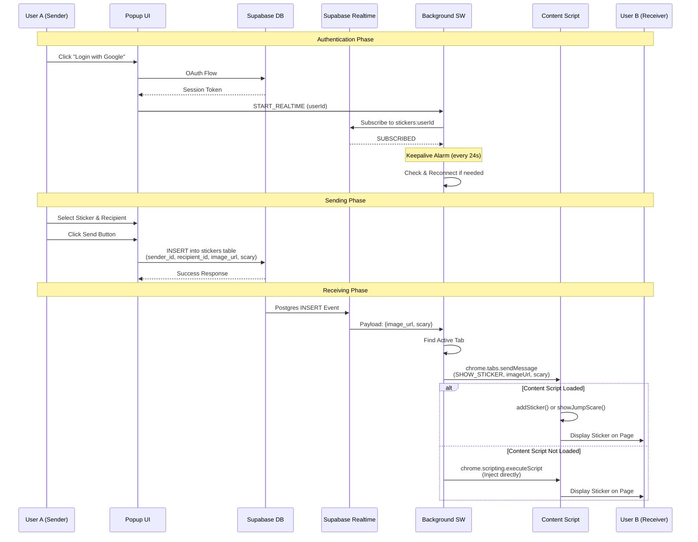
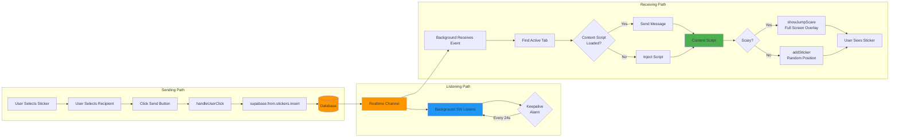
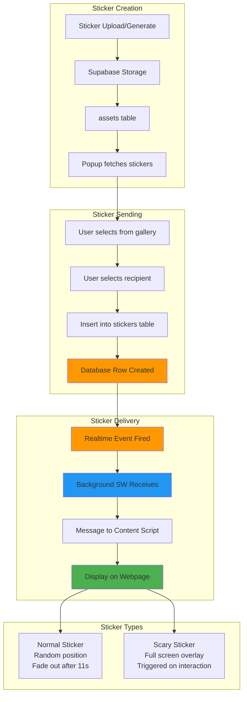
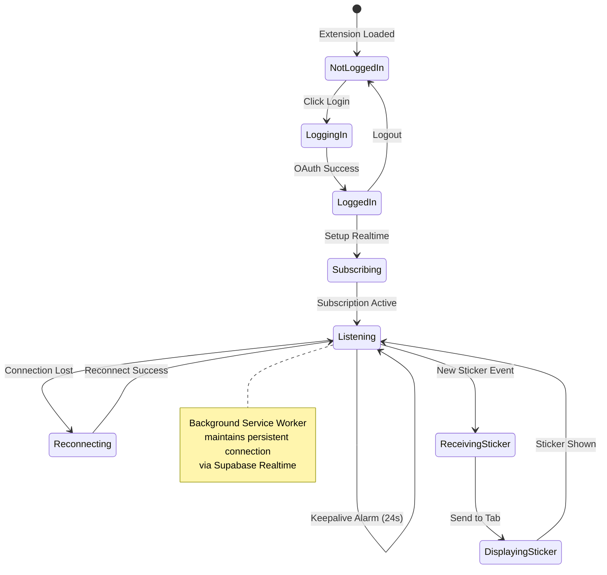

# Sticky Send Architecture Flow

## Complete System Architecture

```mermaid
graph TB
    subgraph "Chrome Extension Components"
        Popup[Popup UI<br/>hello.html + popup.js]
        Background[Background Service Worker<br/>background.js]
        Content[Content Script<br/>content.js]
    end
    
    subgraph "Supabase Backend"
        Auth[Supabase Auth<br/>Google OAuth]
        DB[(PostgreSQL Database<br/>stickers table)]
        Realtime[Supabase Realtime<br/>Postgres Changes]
        Storage[Supabase Storage<br/>Sticker Images]
    end
    
    subgraph "User Actions"
        User1[User A<br/>Sends Sticker]
        User2[User B<br/>Receives Sticker]
    end
    
    %% Authentication Flow
    User1 -->|1. Login| Auth
    Auth -->|2. Session| Popup
    
    %% Sending Flow
    Popup -->|3. Select Sticker & Recipient| Popup
    Popup -->|4. Insert Record| DB
    DB -->|5. Trigger INSERT Event| Realtime
    
    %% Listening Flow
    Popup -->|6. START_REALTIME Message| Background
    Background -->|7. Subscribe to Channel| Realtime
    Background -->|8. Keepalive Alarms| Background
    
    %% Receiving Flow
    Realtime -->|9. New Sticker Event| Background
    Background -->|10. SHOW_STICKER Message| Content
    Content -->|11. Display Sticker| User2
    
    %% Styling
    classDef extension fill:#e1f5ff,stroke:#01579b,stroke-width:2px
    classDef backend fill:#fff3e0,stroke:#e65100,stroke-width:2px
    classDef user fill:#f3e5f5,stroke:#4a148c,stroke-width:2px
    
    class Popup,Background,Content extension
    class Auth,DB,Realtime,Storage backend
    class User1,User2 user
```

## Detailed Flow Diagram

```mermaid
sequenceDiagram
    participant UserA as User A (Sender)
    participant Popup as Popup UI
    participant Supabase as Supabase DB
    participant Realtime as Supabase Realtime
    participant Background as Background SW
    participant Content as Content Script
    participant UserB as User B (Receiver)
    
    Note over UserA,UserB: Authentication Phase
    UserA->>Popup: Click "Login with Google"
    Popup->>Supabase: OAuth Flow
    Supabase-->>Popup: Session Token
    Popup->>Background: START_REALTIME (userId)
    Background->>Realtime: Subscribe to stickers:userId
    Realtime-->>Background: SUBSCRIBED
    
    Note over Background: Keepalive Alarm (every 24s)
    Background->>Background: Check & Reconnect if needed
    
    Note over UserA,UserB: Sending Phase
    UserA->>Popup: Select Sticker & Recipient
    UserA->>Popup: Click Send Button
    Popup->>Supabase: INSERT into stickers table<br/>(sender_id, recipient_id, image_url, scary)
    Supabase-->>Popup: Success Response
    
    Note over UserA,UserB: Receiving Phase
    Supabase->>Realtime: Postgres INSERT Event
    Realtime->>Background: Payload: {image_url, scary}
    Background->>Background: Find Active Tab
    Background->>Content: chrome.tabs.sendMessage<br/>(SHOW_STICKER, imageUrl, scary)
    
    alt Content Script Loaded
        Content->>Content: addSticker() or showJumpScare()
        Content->>UserB: Display Sticker on Page
    else Content Script Not Loaded
        Background->>Content: chrome.scripting.executeScript<br/>(Inject directly)
        Content->>UserB: Display Sticker on Page
    end
```

## Component Interaction Flow

```mermaid
flowchart LR
    subgraph "Sending Path"
        A[User Selects Sticker] --> B[User Selects Recipient]
        B --> C[Click Send Button]
        C --> D[handleUserClick]
        D --> E[supabase.from.stickers.insert]
        E --> F[(Database)]
    end
    
    subgraph "Listening Path"
        F --> G[Realtime Channel]
        G --> H[Background SW Listens]
        H --> I{Keepalive<br/>Alarm}
        I -->|Every 24s| H
    end
    
    subgraph "Receiving Path"
        G --> J[Background Receives Event]
        J --> K[Find Active Tab]
        K --> L{Content Script<br/>Loaded?}
        L -->|Yes| M[Send Message]
        L -->|No| N[Inject Script]
        M --> O[Content Script]
        N --> O
        O --> P{Scary?}
        P -->|Yes| Q[showJumpScare<br/>Full Screen Overlay]
        P -->|No| R[addSticker<br/>Random Position]
        Q --> S[User Sees Sticker]
        R --> S
    end
    
    style F fill:#ff9800
    style G fill:#ff9800
    style H fill:#2196f3
    style O fill:#4caf50
```

## Data Flow Diagram

```mermaid
graph TD
    subgraph "Sticker Creation"
        A[Sticker Upload/Generate] --> B[Supabase Storage]
        B --> C[assets table]
        C --> D[Popup fetches stickers]
    end
    
    subgraph "Sticker Sending"
        D --> E[User selects from gallery]
        E --> F[User selects recipient]
        F --> G[Insert into stickers table]
        G --> H[Database Row Created]
    end
    
    subgraph "Sticker Delivery"
        H --> I[Realtime Event Fired]
        I --> J[Background SW Receives]
        J --> K[Message to Content Script]
        K --> L[Display on Webpage]
    end
    
    subgraph "Sticker Types"
        L --> M[Normal Sticker<br/>Random position<br/>Fade out after 11s]
        L --> N[Scary Sticker<br/>Full screen overlay<br/>Triggered on interaction]
    end
    
    style H fill:#ff9800
    style I fill:#ff9800
    style J fill:#2196f3
    style L fill:#4caf50
```

## State Management Flow

```mermaid
stateDiagram-v2
    [*] --> NotLoggedIn: Extension Loaded
    
    NotLoggedIn --> LoggingIn: Click Login
    LoggingIn --> LoggedIn: OAuth Success
    
    LoggedIn --> Subscribing: Setup Realtime
    Subscribing --> Listening: Subscription Active
    
    Listening --> Listening: Keepalive Alarm (24s)
    Listening --> Reconnecting: Connection Lost
    Reconnecting --> Listening: Reconnect Success
    
    Listening --> ReceivingSticker: New Sticker Event
    ReceivingSticker --> DisplayingSticker: Send to Tab
    DisplayingSticker --> Listening: Sticker Shown
    
    LoggedIn --> NotLoggedIn: Logout
    
    note right of Listening
        Background Service Worker
        maintains persistent connection
        via Supabase Realtime
    end note
```
